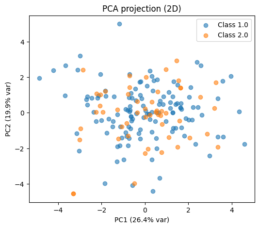
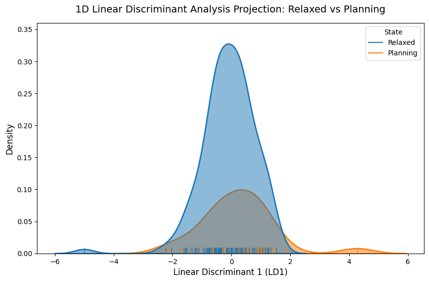

# Classifiying Relaxed and Planning States 
This documnetation essentially goes through my effort in understanding the dataset and attempts write a classifier.

## TLDR
- There was alot of signs that the feature set that we had doesn't really exhibit seperability with each other.
- https://ieeexplore.ieee.org/document/7100718 and https://www.academia.edu/9480534/Classification_of_EEG_Signals_by_using_Support_Vector_Machines feels misleading by showing an accuracy of 71.4%, which in fact is simply because of class imbalance. Showing their confusion matrix would have been more apt.

### About the dataset
[Link to Dataset](https://archive.ics.uci.edu/dataset/230/planning+relax) contains 182 records of 12 coefficients which are obtained by applying wavelet packet transform in the 7-13Hz range over the time period when the task was done (Relaxed = 1, Planing = 2). 

<b>The dataset has a massive class imbalance. 130 for relaxed and 52 for planning. Please note that 71.4% of data records belongs to relaxing</b>


### Objective
The objective here is, given a set of 12 features and a label, can we train a classifier to distinguish between resting state and motor planning state.

### Preliminary Data Analysis
#### Statistical Tests
- The coefficients c1, c9, c10, c11, c12 fails the normality test. That is the coefficients do not form a gaussian distribution
- Welch's t-test and Mann-Whitley shows that the data points across 12 features are identical for both the classes
- The effect size from Cohen's d-value test shows that the distance between the two classes are minimal as well
- Variation Inflation Factor shows that except c8, every coefficient has VIF > 10, which shows high redundancy.

#### Pairplot


#### Dimensionality Reduction Techniques


### Linear Discriminant Analysis

As we can see above, LDA cannot figure out the seperability between the two classes. 

### SVM
- An SVM was run with parameters C = 10, gamma = 0.1 and polynomial kernel which was identified after a grid search.  
- The pipeline was made to standardize the dataset, apply RandomOverSampler to oversample the minority class, and fed to the SVM with the above parameters
- Now, a 10-Cross Fold Validation was done to obtain the following results, with the final accuracy of 47%, which is less than tossing a coin.

```
Final Confusion Matrix (Unbiased 10-Fold Outer Predict):
[[97 33]
 [41 11]]

Final Classification Report:
                precision    recall  f1-score   support

 1.0 (Relaxed)       0.70      0.75      0.72       130
2.0 (Planning)       0.25      0.21      0.23        52

      accuracy                           0.59       182
     macro avg       0.48      0.48      0.48       182
  weighted avg       0.57      0.59      0.58       182
```